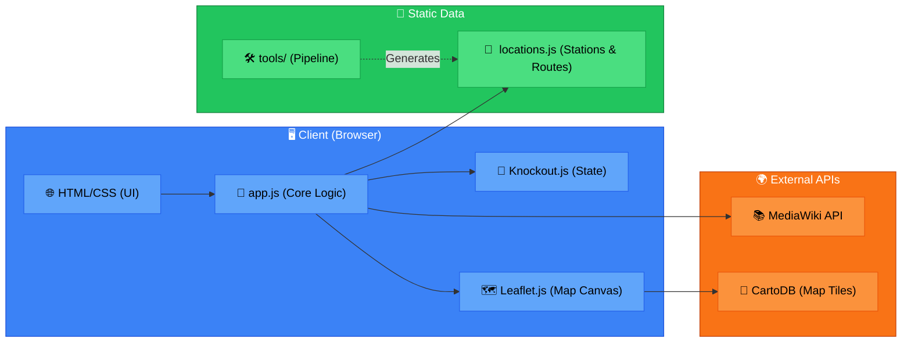

# Namma Metro Map
This app shows the operational [Metro Rapid Transit in Bengaluru](https://en.wikipedia.org/wiki/Namma_Metro) using a sleek, interactive map interface.

## How to use the App
- Visit the [Namma Metro Map - Live version](https://manubhargav.github.io/NammaMetroMap/)
- **Or** clone/download this repository to your computer and simply open `index.html` in your browser. (No API keys required!)

## Features
The application runs entirely on the client side using modern mapping solutions without any billing dependencies.
- **Mapping Engine:** [Leaflet.js](https://leafletjs.com/) handles all interactive map rendering, panning, and rendering routing polylines.
- **Map Tiles:** Powered by [CartoDB Positron](https://carto.com/), offering a beautiful, minimalist greyscale basemap that lets the vivid metro lines pop out. The map also includes options to toggle to Standard OpenStreetMap or Esri Satellite imagery.
- **Station Data:** The app references a local static dataset (`js/locations.js`) to plot stations and map out topological routes seamlessly.
- **Dynamic Content:** [MediaWiki API](https://en.wikipedia.org/w/api.php) dynamically fetches introductory Wikipedia summaries whenever a station marker is clicked.

## Architecture

The application runs entirely on the client side without billing dependencies.



## Project Structure

```text
/
├── css/
│   └── style.css           # Application styling (sidebar, map layout, theming)
├── js/
│   ├── app.js              # Core application logic (Leaflet initialization, API calls, Knockout VM)
│   ├── knockout-3.4.1.js   # MVVM framework for UI state management
│   ├── jquery-3.1.1.min.js # AJAX requests to MediaWiki
│   └── locations.js        # Static dataset containing topological order of Metro lines and station coords
├── tools/                  # Offline data generation pipeline
│   ├── raw_data/           # Raw OSM JSON downloads
│   ├── get_metro.py        # Scrapes current OpenStreetMap nodes
│   ├── parse_metro.py      # Cleans and drops redundant nodes
│   └── fix_routes.py       # Interleaves lines, sorts arrays, injects output to js/locations.js
├── index.html              # Main application entry point
└── README.md               # Documentation
```

### Updating Station Data (Future-Proofing)
As new Namma Metro lines and stations open in the future, the map data can be regenerated offline using the provided Python pipeline in the `tools/` directory:
1. Navigate to the `tools/` directory.
2. Run `get_metro.py` to query fresh OpenStreetMap node coordinates for the metro network.
3. Run `parse_metro.py` to merge everything into a unified `raw_data/stations_data.json`.
4. Run `fix_routes.py` and strictly assign new topological arrays to output the final `js/locations.js` file used by the frontend.

## Libraries used:
- jQuery
- Knockout JS
- Leaflet.js
 